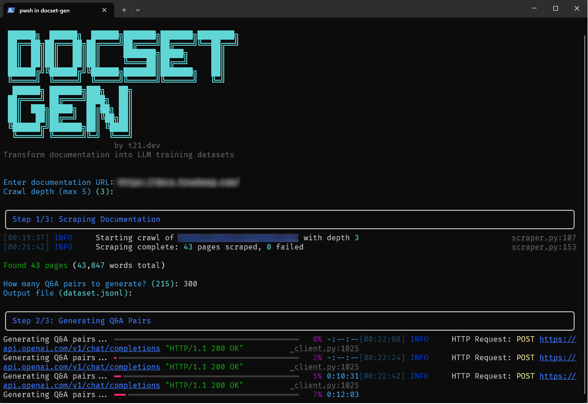

# DocSet Gen

<p align="center">
  
</p>

> Transform documentation into LLM training datasets

DocSet Gen scrapes documentation websites and generates high-quality Q&A training datasets for fine-tuning LLMs.

## Features

- **Smart Scraping** - Uses Firecrawl to handle JS-rendered sites, anti-bot measures, and content cleaning
- **AI-Powered Generation** - Generates Q&A pairs using GPT-4o/GPT-4o-mini
- **Interactive CLI** - Guided prompts walk you through the process
- **Quality Controls** - Automatic deduplication, validation, and filtering
- **Ready-to-Use Output** - JSONL format with automatic train/val/test splits

## Installation

```bash
# Clone the repository
git clone https://github.com/t21dev/docset-gen.git
cd docset-gen

# Create virtual environment
python -m venv venv

# Activate virtual environment
# Windows:
venv\Scripts\activate
# macOS/Linux:
source venv/bin/activate

# Install dependencies
pip install -r requirements.txt
```

## Configuration

1. Copy the example environment file:
```bash
cp .env.example .env
```

2. Edit `.env` with your API keys:
```bash
FIRECRAWL_API_KEY=fc-your-key-here
OPENAI_API_KEY=sk-your-key-here
```

> **Note:** The default model is `gpt-5.1`. Make sure you have access to this model enabled in your [OpenAI developer account](https://platform.openai.com/settings/organization/limits). You can change the model in `.env` by setting `OPENAI_MODEL=gpt-4o` or another supported model.

## Usage

Just run:
```bash
python app.py
```

The interactive CLI will guide you:
```
 ██████╗  ██████╗  ██████╗███████╗███████╗████████╗
 ██╔══██╗██╔═══██╗██╔════╝██╔════╝██╔════╝╚══██╔══╝
 ██║  ██║██║   ██║██║     ███████╗█████╗     ██║
 ██║  ██║██║   ██║██║     ╚════██║██╔══╝     ██║
 ██████╔╝╚██████╔╝╚██████╗███████║███████╗   ██║
 ╚═════╝  ╚═════╝  ╚═════╝╚══════╝╚══════╝   ╚═╝
  ██████╗ ███████╗███╗   ██╗
 ██╔════╝ ██╔════╝████╗  ██║
 ██║  ███╗█████╗  ██╔██╗ ██║
 ██║   ██║██╔══╝  ██║╚██╗██║
 ╚██████╔╝███████╗██║ ╚████║
  ╚═════╝ ╚══════╝╚═╝  ╚═══╝
                        by t21.dev
Transform documentation into LLM training datasets

Enter documentation URL: docs.example.com
Crawl depth [3]: 3

──────── Step 1/3: Scraping Documentation ────────

Found 45 pages (23,450 words total)

How many Q&A pairs to generate? [225]: 200
Output file [dataset.jsonl]:

──────── Step 2/3: Generating Q&A Pairs ──────────

Generated 200 Q&A pairs

──────── Step 3/3: Cleaning and Saving ───────────

┌────────────── Dataset Complete ──────────────┐
│ Pages Scraped       │ 45                     │
│ Q&A Pairs Generated │ 200                    │
│ Train / Val / Test  │ 160 / 20 / 20          │
│ Output              │ dataset.jsonl          │
└──────────────────────────────────────────────┘
```

### Manual Commands

You can also run individual steps:

```bash
# Just scrape (save for later)
python app.py scrape https://docs.example.com --output ./scraped

# Generate from previously scraped content
python app.py generate ./scraped --pairs 500 --output dataset.jsonl

# Create config file
python app.py init
```

## Output Format

```json
{"instruction": "What is dependency injection?", "input": "", "output": "Dependency injection is..."}
{"instruction": "How do I configure logging?", "input": "", "output": "To configure logging..."}
```

## Configuration File (Optional)

Create `docset-gen.yaml` for advanced settings:

```yaml
firecrawl:
  max_depth: 3
  exclude_patterns:
    - "/changelog/*"
    - "/blog/*"

openai:
  model: gpt-4o-mini
  temperature: 0.7

generation:
  mode: qa
  pairs_per_page: 5

output:
  split_ratio: [0.8, 0.1, 0.1]
```

## Requirements

- Python 3.10+
- [Firecrawl API key](https://firecrawl.dev)
- [OpenAI API key](https://platform.openai.com)

## Fine-tune with LoCLI

This tool pairs perfectly with [LoCLI](https://github.com/t21dev/lo-cli) - a CLI tool that makes fine-tuning LLMs accessible to developers. Just point it at your dataset and go.

```bash
# Generate dataset with DocSet Gen
python app.py

# Fine-tune with LoCLI
lo-cli train --dataset dataset.jsonl
```

## License

MIT License - see [LICENSE](LICENSE)

## Author

Created by [@TriptoAfsin](https://github.com/TriptoAfsin) | [t21dev](https://github.com/t21dev)
